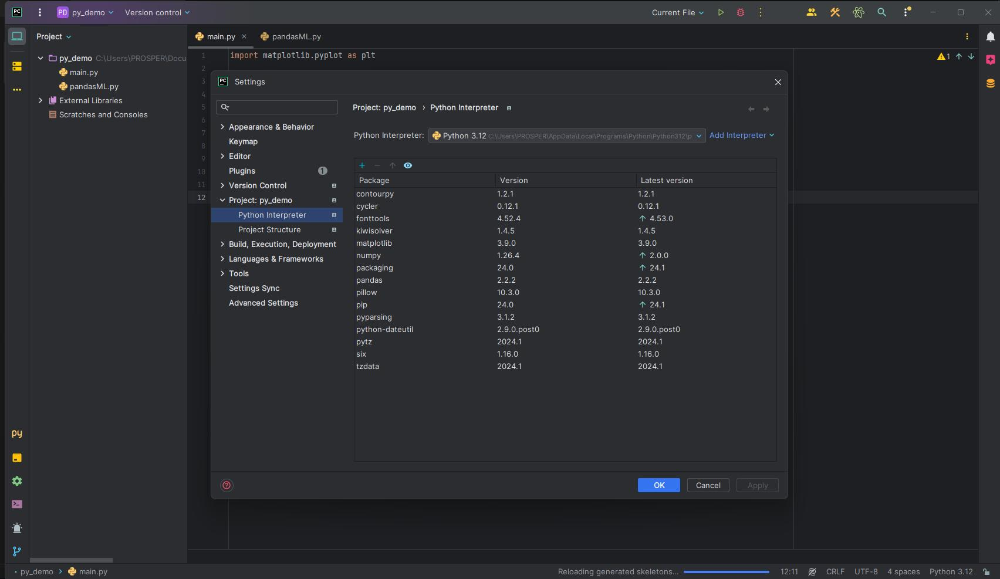

# Setup Development Environment
## Python Development
 * Download and Install Python:
Download the latest version of Python from the official website.

 * Install Python on your system.
Configure Jetbrains PyCharm:

 * Open PyCharm.
Configure the IDE settings according to your preferences.

 * Final Adjustments:
Make any additional adjustments in PyCharm to enhance your development experience.

## Dart and Flutter Development
 * Jetbrains IntelliJ IDE:
Use Jetbrains IntelliJ IDE for Dart and Flutter development.
 * Install Flutter and Dart extensions in the IDE.

## MySQL Development
* Using Docker for MySQL:
Containerize your MySQL application using Docker.

* This approach simplifies the setup and management of the database environment.
  
